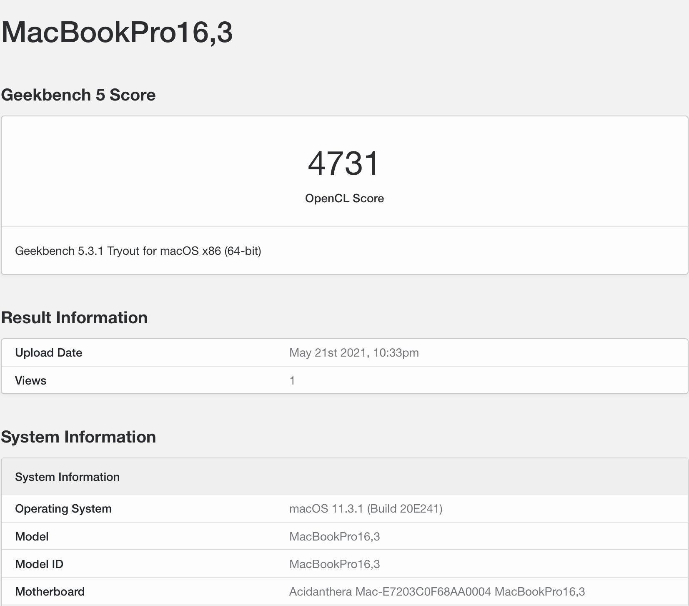
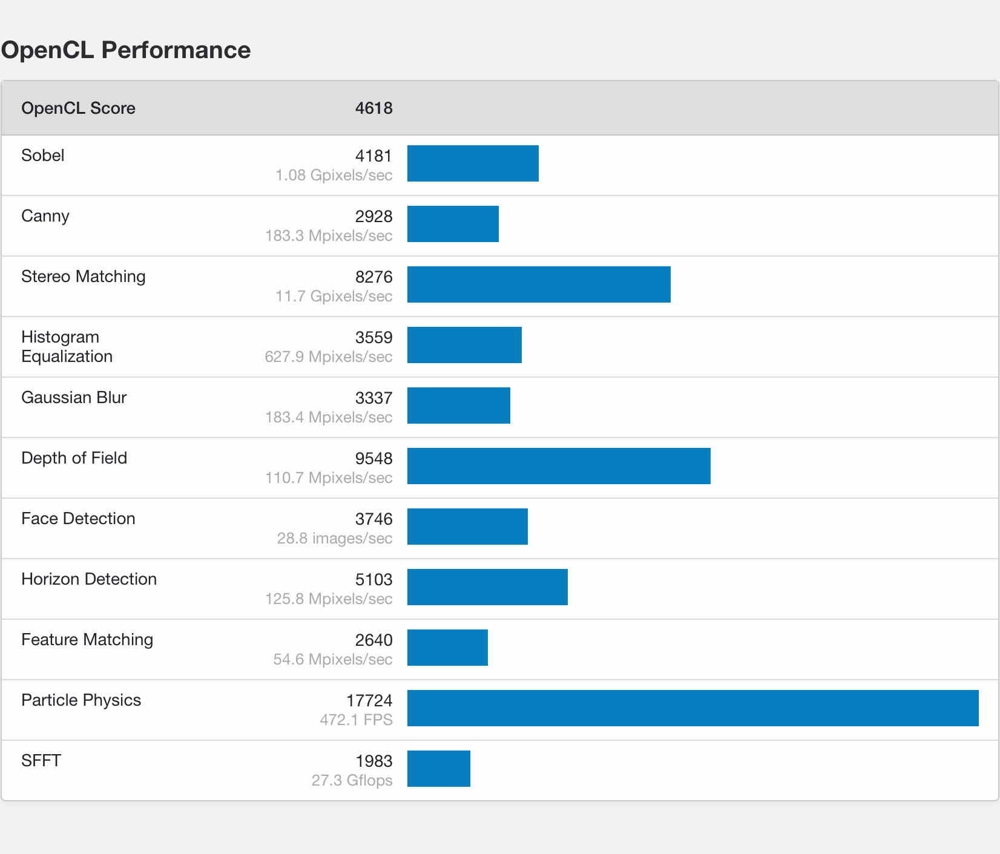

# Huawei Matebook X Pro (2018 Edition)
[](https://consumer.huawei.com/it/support/laptops/matebook-x-pro/)
[](https://consumer.huawei.com/it/support/laptops/matebook-x-pro/)
[](/LICENSE)
[](https://github.com/profzei/Matebook-X-Pro-2018/releases)
[](https://github.com/profzei/Matebook-X-Pro-2018/wiki)

### macOS on Huawei Matebook X Pro 2018
<p align="center">

</p>

#### This repo is currently compatible with macOS Big Sur, Catalina and OpenCore 0.6.5
|     macOS Big Sur      |     macOS Catalina     |       macOS Mojave       |
|------------------------|------------------------|--------------------------|
|     11.2 (20D64)       |     10.15.7  (19H15)   |       10.14.6  (18G87)   |
|     11.1 (20C69)       |     10.15.6  (19G2021) |       10.14.5  (18F132)  |
|     11.0.1 (20B29)     |     10.15.5  (19F101)  |       10.14.4  (18E226)  |
|                        |     10.15.4  (19E287)  |       10.14.3  (18D42)   |
|                        |     10.15.3  (19D76)   |       10.14.2  (18C54)   |
|                        |     10.15.2  (19C57)   |       10.14.1  (18B75)   |
|                        |     10.15.1  (19B88)   |       10.14    (18A389)  |
|                        |     10.15    (19A583)  |                          |


### DISCLAIMER

- Read the entire README before you start.
- I am not responsible for any damages you may cause.
- Should you find an error or improve anything — whether in the config or in the documentation — please consider opening an issue or pull request.
- **Complete EFI packs** are available in the [**Releases**](https://github.com/profzei/Matebook-X-Pro-2018/releases) page (please, refer to the rightside menu).
- Please **do not clone or download** the main branch for daily use: it may include **unstable code** just because it is my repository.

<p align="center">

</p>

If you find this bootloader configuration useful, consider **giving** it **a star** to make it more visible.

If you find my work useful, please consider **donating via PayPal**. [](https://www.paypal.com/cgi-bin/webscr?cmd=_donations&business=TSJHK3C2BSQN6&currency_code=EUR)

## Introduction

This repo contains information for getting macOS working on a **Huawei MateBook X Pro (2018 Edition)** laptop.

This is intended to create a "fully" functional (as far as possible) hackintosh for the Huawei Matebook X Pro.
If you would like to get started with creating a hackintosh on your MBXP but have non experience, I would highly recomend following [**Dortania's OpenCore Install guide**](https://dortania.github.io/OpenCore-Install-Guide/) and then returning here for troubleshooting.
With each new release of macOS we need to resolve each new "minor issue" we run into. The installation is not perfect yet since it's a continuos work-in-progress, but I'm glad to say that **I learned a lot** in the meantime. All of the steps I made to get to this point were a result of countless hours of reading along with trial and error. I am by no means an expert so any help to get this project functional is very appreciated!

- The **compatibility** is **very good** for the most part, most of the stuff works like it would on a real MacBook, including camera, audio, touchpad, iCloud services.
- The **experience** is **pleasant**, as the laptop is smooth and responsive under macOS Big Sur/Catalina.
- **Battery life** is **quite great** (from personal experience it lasts from 8 to 10 hours for light works depending on its age with a behaviour very similar to Windows 10).
- The **Intel WiFi** card is soldered onto the motherboard, which means it can't be replaced with a Broadcom one, but the Intel card is now **functional albeit not operating at full speeds** (however it is fine for most use cases). With the latest `AirportItlwm.kext` even Handoff and Continuity features are working, but with a very limited support for AirDrop and Apple Watch unlocking (see [Changelog for OpenIntelWireless release v. 1.2.0 stable](https://github.com/OpenIntelWireless/itlwm/releases)). For any issues about `AirportItlwm.kext` please refer to [**OpenIntelWireless Gitter Page**](https://gitter.im/OpenIntelWireless/itlwm?utm_source=badge&utm_medium=badge&utm_campaign=pr-badge&utm_content=badge)


**This repository is for personal purposes**

### Generate your own SMBIOS Information

For privacy reasons, all SMBIOS information has been wiped out in the configuration file `EFI/OC/config.plist`. You need to generate your unique SMBIOS info by yourself (recommend to use [**CorpNewt's GenSMBIOS**](https://github.com/corpnewt/GenSMBIOS)), and inject them into your `config.plist`.

## Configuration

| Specifications      | Details                                          |
| :--- | :--- |
| Computer model      | Huawei Matebook X Pro 2018 Space Gray            |
| Processor           | Intel Core i7-8550U Processor @ 1.8 GHz          |
| Memory              | 8 GB LPDDR3 2133 MHz                             |
| Hard Disk           | LiteON SSD PCIe NVMe 512 GB [CA3-8D512]          |
| Integrated Graphics | NVIDIA GeForce MX150 / Intel(R) UHD Graphics 620 |
| Screen              | JDI 3k Display @ 3000 x 2000 (13.9 inch)         |
| Sound Card          | Realtek ALC256                                   |
| Wireless Card       | Intel Dual Band Wireless-AC 8265/8275            |
| Bluetooth Card      | Intel Bluetooth 8265/8275                        |

**Device Firmware** Bios version: `1.28`

<details>
<summary><strong>Benchmarks</strong></summary>

|   |  |
|:---:|:---:|
| System configuration | **GPU** - **OpenCL** Single-Core **4618** |
</details>

## Changelog

#### 2021 - February - 03
See [**Current status**](Changelog.md)

## Status

- [x] **Intel(R) UHD 620** Graphics card  
- [x] **Intel(R) Wireless-AC** 8265/8275 & **Intel(R) Bluetooth**
- [x] **Power Management** with support for HWP (Intel Speed Shift & Intel SpeedStep)
- [x] **Sleep** and **Wake** (support for native macOS `hibernatemode3`)
- [x] **Hibernation** (support for native macOS `hibernatemode25` with `HibernationFixup.kext`)
- [x] **Battery support** with better memory access and integration of [Battery Information Supplement](https://github.com/acidanthera/VirtualSMC/blob/master/Docs/Battery%20Information%20Supplement.md)
- [x] **Automatic Backlight control** (with more granular levels)
- [x] Backlight shortcuts (F1 [brightness level down] - F2 [brightness level up])
- [x] Volume shortcuts (F4 [mute] - F5 [audio level down] - F6 [audio level up])
- [x] **Audio** for **Realtek ALC256** card (via `AppleALC.kext` and `layout-id 97`)
- [x] **Speakers** (4 Channels) & Internal Mic
- [x] **Headphone** jack [2 in 1]  (via `ALCPlugFix`)
- [x] **HDMI 2.0** up to two 4K @60 Hz monitors (via LSPCON)
- [x] **Native Color Profile** for Display JDI 3k
- [x] **TouchPad** (via `GPI0` interrupt mode) and **native macOS gestures**
- [x] Touchscreen
- [x] Updated support for LiteON SSD PCIe NVMe 
- [x] PCI Devices latency support and complete description for System Information app
- [x] **USB Ports Mapping** (Type-A & Type-C) with proper power levels
- [x] **Thunderbolt Port** (limited support)
- [x] HD Camera
- [x] NVRAM native support

<details>
<summary><strong>Notes</strong></summary>

1. **Intel Bluetooth** could not support some Bluetooth devices like some Bluetooth mouse since it is only a firmware injector; please, report any issues not here but only on [**OpenIntelWireless/IntelBluetoothFirmware Gitter Chat**](https://gitter.im/OpenIntelWireless/IntelBluetoothFirmware?utm_source=badge&utm_medium=badge&utm_campaign=pr-badge&utm_content=badge)
2. **Touchscreen support is disabled by default** since [release v. 1.8.0](https://github.com/profzei/Matebook-X-Pro-2018/releases). Why? It seems that all `VoodooI2C` versions after 2.4 are affected to a greater or lesser extent by `Multi_GPI0` issues.
The solution proposed so far by `VoodooI2C` developers is only a workaround and not a real fix: proposing to use the `GPI0` pinning for touchpad and polling method for touchscreen is not a real fix because this approach increases interrupts and causes a degrade in battery life. This being the case and not needing to use the touchscreen in my daily work, for the moment I have disabled this function pending improvements that can only come from `VoodooI2C` developers.
</details>

<details>
<summary><strong>Thunderbolt support</strong></summary>

As reported in [NotebookCheck review](https://www.notebookcheck.net/Huawei-has-pulled-a-Dell-the-MateBook-X-Pro-uses-a-gimped-Thunderbolt-3-port.316550.0.html) our Matebook X pro (2018) is utilizing only half the PCIe lanes for its single Thunderbolt 3 port (TB). Thus, its PCIe x2 Thunderbolt 3 port is only capable of providing a maximum of 20 Gbps instead of 40 Gbps when compared to a standard Thunderbolt 3 port with PCIe x4 lanes.

The connector type is Usb-C and it can do multiple protocols (TB, USB 2/3/3.1, DP, etc...) with different backing controllers. The problem on Hackintoshes is mostly about TB on Usb-C, because the firmware and power management of Apple's TB-controllers works entirely different than those for other OS'es. So even if it's the same hardware found on Windows laptops, they don't "just work" because of the different firmware.

The ACPI-part for handling Thunderbolt 3 port and its power management has been implemented:
- it enables not only the PCIe-to-PCIe-bridge mode of the TB controller but also the native drivers which make it possible to completely poweroff the controller after using the TB port, saving battery life and prevent the controller from preventing the CPU goes into deeper C-State
- the ICM is disabled on boot to let OSX' drivers take over the job
- the TB port works when any device is plugged into it at the boot time: this means no hot-plug
- it's largely untested since I don't have any TB 3 devices.

For reference, see [Thunderbolt 3 Fix](https://osy.gitbook.io/hac-mini-guide/details/thunderbolt-3-fix-part-3) and [ThunderboltPatcher](https://github.com/osy86/ThunderboltPatcher) for related attempts to fix TB by patching its firmware.

Due to lack of Thunderbolt devices my interest in this feature is very marginal; therefore, in my default `config.plist`, **Thunderbolt controller has been left disabled**.
</details>

<details>
<summary><strong>What's not working</strong></summary>

- [ ] **Discrete graphics card** (NVIDIA GeForce MX150) is not working, since macOS doesn't support Optimus technology
	- Have used `SSDT-DDGPU.aml` to disable it in order to save power.
- [ ] **Fingerprint sensor** is not working
	- Fingerprint readers on Macbooks are managed by T2 chip which has not been very throughly reverse engineered yet
	- Have used `SSDT-XHC.aml` to disable it (in order to save some power).
</details>

## Bootloader Firmware
- Default bootloader: `OpenCore 0.6.5` [Official release](https://github.com/acidanthera/OpenCorePkg/releases). See more info in [Wiki section](https://github.com/profzei/Matebook-X-Pro-2018/wiki/Converting-from-Clover-to-OpenCore) about migration.
- No longer maintained: Clover `r5118` [Official release](https://github.com/CloverHackyColor/CloverBootloader/releases) ~~`r5103` [Dids release](https://github.com/Dids/clover-builder/releases)~~

<details>
<summary><strong>OpenCore</strong></summary>

- Support macOS 10.14 ~ macOS 11.1
- **For dual-booting systems, Windows Activation may fail due to different hardware UUID generated by OpenCore**
	- According to [OpenCore Official Configuration](https://github.com/acidanthera/OpenCorePkg/blob/master/Docs/Configuration.pdf), you are highly recommended to inject the **original Windows system UUID** to `PlatformInfo -> Generic - >SystemUUID` in `EFI/OC/config.plist`: run `wmic csproduct get UUID` command in Windows PowerShell app 
- Limited theme with `OpenCanopy`: a cleaner version with custom graphics has been provided by **@R-Teer**
</details>

## Post - Install
<details>
<summary><strong>Enable Apple Services</strong></summary>

Default **SMBIOS** settings of this repo is `MacBookPro14,1` ~~`MacBookPro15,2`~~
1. Launch `Terminal` app
2. Copy the following script, paste it into the `Terminal` window, then press `Enter`
   ```bash
   git clone https://github.com/corpnewt/GenSMBIOS && cd GenSMBIOS && ./GenSMBIOS.command 
   ```
3. Type `2`, then press `Enter`
4. Drag your `config.plist` inside the `Terminal` window
5. Type `3`, then press `Enter`
6. Type `MacBookPro14,1`, then press `Enter`
</details>

<details>
<summary><strong>Activate Surround Sound via MIDI</strong></summary>

For a detailed guide on how to activate surround sound via MIDI on internal speakers and native audio shortcuts, see [Wiki section](https://github.com/profzei/Matebook-X-Pro-2018/wiki/Activate-Surround-Sound-via-MIDI-on-internal-speakers) 
</details>

<details>
<summary><strong>Undervolt using VoltageShift</strong></summary>

Undervolting is a great way to to maximise performance, lower power consumption and reduce temperatures.

For a detailed guide on how to undervolt our MBXP using `VoltageShift` from the EFI folder instead of disabling SIP, see [Wiki section](https://github.com/profzei/Matebook-X-Pro-2018/wiki/Undervolt-via-VoltageShift) 
</details>

## Power management
<details>
<summary><strong>CPUFriend</strong></summary>

CPU power management can be achieved by using `CPUFriend.kext` while `CPUFriendDataProvider.kext` defines how it should be done. `CPUFriendDataProvider.kext` is generated for a specific CPU and power setting. The one supplied in this repository was made for `i7-8550U` and is optimized for balanced performance.
- The kexts and SSDT for `i7-8550U` are [here](/CPUFriend/1.2.0).
- `CPUFriendDataProvider.kext` is generated for SMBIOS `MacBookPro15,2` because of Kaby Lake R architecture.
- `CPUFriend.kext` and `CPUFriendDataProvider.kext` need to be put in `CLOVER/kexts/Other`
- Furthermore, you also need to put `SSDT-XCPM.aml` in `CLOVER/ACPI/patched` for working as normal after awake.
</details>

<details>
<summary><strong>Sleep & Hibernation settings</strong></summary>

**Sleep** function works flawlessly (both via software and via clamshell) like **hibernation** (suspend to disk or S4 sleep). In order to get automatic sleep working properly like real Macs, the following settings are mandatory: 
```
sudo pmset -a standby 0
sudo pmset -a powernap 0 
sudo pmset -a proximitywake 0
sudo pmset -a tcpkeepalive 0
sudo pmset -a womp 0
```
- `powernap` will wake up the system from time to time to check mail, make Time Machine backups, etc...
- `proximitywake` can wake your machine when an iDevice is near.
- `tcpkeepalive` has resolved periodic wake events after setting up iCloud.
- `womp` is wake on lan.

Default macOS setting is **hibernatemode 3** i.e. **sleep mode**.

**After every update, ALL these settings should be reapplied manually!**

**Hibernation mode** can be enabled only via console command `sudo pmset -a hibernatemode 25` and is fully supported by Matebook X Pro (obviously using `HibernationFixup` kext). If, however, you would like to disable it, then
```
sudo pmset -a hibernatemode 0
sudo pmset -a autopoweroff 0
sudo rm -rf /private/var/vm/sleepimage
sudo touch /private/var/vm/sleepimage
sudo chflags uchg /private/var/vm/sleepimage
```

You can verify your power settings by typing in terminal `sudo pmset -g live` . If you ever want to reset these settings: `sudo pmset -a restoredefaults`

About power consumption, [HWMonitor](https://github.com/kzlekk/HWSensors/releases) reports for the idle state both before and after sleep phase the same value for "CPU package total" (0.65-0.70 W). Sleep discharge rate is about 1% every 4:30 hours (during night).
</details>

## USB port mapping
<details>
<summary><strong>Mapping scheme</strong></summary>

Proper `SSDT-XHC.aml` is used for USB Host Controller (XHCI-Device-ID: `<2f 9d 00 00>`): this file is configured to map only the necessary ports (tested with IOReg) with the correct connector type and prevent it from shutdown issues.

| Port      | Address               | Physical Location                                         | Internal/External |
| :--- | :--- | :--- | :--- |
| HS01/SS01 | `00000001`/`0000000D` | Left Port type-C (Power Source) - next to 3.5mm jack port | E                 |
| HS02/SS02 | `00000002`/`0000000E` | Right Port type-A                                         | E                 |
| HS03      | `00000003`            | Left Port type-C Thunderbolt                              | E                 |
| HS05      | `00000005`            | Bluetooth USB Port                                        | I                 |
| HS07      | `00000007`            | Integrated HD Camera module                               | I                 |

</details>

## Optional
<details>
<summary><strong>Monitor temperatures and power consumption with HWMonitor</strong></summary>

[**HWMonitor**](https://github.com/kzlekk/HWSensors/releases) is relatively old and no longer supported, but it gets the job done.
</details>

<details>
<summary><strong>Make dock animation faster and without delay</strong></summary>

Run these lines in terminal:
```
defaults write com.apple.dock autohide-delay -float 0
defaults write com.apple.dock autohide-time-modifier -float 0.5
killall Dock
```

</details>

<details>  
<summary><strong>Fix AppleID issue on macOS Catalina</strong></summary>

- If you encounter the problem with AppleID which cannot login and logout, this problem happened on both Hackintosh and Macintosh.
- Fix this issue with the following commands:
```
sudo -v
killall -9 accountsd com.apple.iCloudHelper
defaults delete MobileMeAccounts
rm -rf ~/Library/Accounts
killall -9 accountsd com.apple.iCloudHelper
sudo reboot
```

</details>

<details>  
<summary><strong>Graphics section</strong></summary>

Refer to: [here](/Graphics/)
</details>

<details>  
<summary><strong>Dual Booting: fix Windows time</strong></summary>

Windows uses local time by default while macOS uses universal time. You can switch Windows 
to use universal time.
Open up a command prompt in Windows as an administrator and copy and paste this in:
```
reg add "HKEY_LOCAL_MACHINE\System\CurrentControlSet\Control\TimeZoneInformation" /v RealTimeIsUniversal /d 1 /t REG_QWORD /f
```
That will make Windows use universal time instead of local time.
Then update your clock via the built-in internet time setting to update the time.

</details>

## Update tracker

| Item | Version | Remark |
| :--- | :--- | :--- |
| MacOS | 11.1 | |
| [OpenCore](https://github.com/acidanthera/OpenCorePkg/releases) | 0.6.5 | Default Bootloader|
| [Lilu](https://github.com/acidanthera/Lilu/releases) | 1.5.0 | Kext/process/framework/library patcher |
| [WhateverGreen](https://github.com/acidanthera/whatevergreen/releases) | 1.4.6 | Handle Graphics card |
| [AppleALC](https://github.com/acidanthera/AppleALC/releases) | 1.5.6 | Handle/fix onboard audio |
| [CodecCommander](https://github.com/Sniki/EAPD-Codec-Commander/releases) | 2.7.2 | Fix headphone audio switch |
| [CPUFriend](https://github.com/acidanthera/CPUFriend/releases) | 1.2.3 | Power management |
| [HibernationFixup](https://github.com/acidanthera/HibernationFixup/releases) | 1.3.9 | Handle hibernate status |
| [IntelBluetoothFirmware](https://github.com/OpenIntelWireless/IntelBluetoothFirmware/releases) | 1.1.2 | Handle Bluetooth |
| [AirportItlwm](https://github.com/OpenIntelWireless/itlwm/releases) | 1.2.0 | Handle native Wi-Fi card |
| [NullEthernet](https://bitbucket.org/RehabMan/OS-X-Null-Ethernet/downloads/) | 1.0.6 | Fake Ethernet card |
| [NoTouchID](https://github.com/al3xtjames/NoTouchID/releases) | 1.0.4 | Disable TouchID|
| [NVMeFix](https://github.com/acidanthera/NVMeFix/releases) | 1.0.5 | Fix for NVMe SSDs |
| [RestrictEvents](https://github.com/acidanthera/RestrictEvents/releases) | 1.0.0 | Block unwanted processes |
| [VoodooI2C](https://github.com/alexandred/VoodooI2C/releases) | 2.5.2 | Handle I2C device |
| [VoodooI2CHID](https://github.com/alexandred/VoodooI2C/releases) | 2.5.2 | Touchpad I2C satellite |
| [VoodooPS2Controller](https://github.com/acidanthera/VoodooPS2/releases) | 2.1.9 | Enable keyboard, alternative trackpad driver |
| [VirtualSMC + plugins](https://github.com/acidanthera/VirtualSMC/releases) | 1.1.9 | SMC chip emulation |
| [USBInjectAll](https://github.com/daliansky/OS-X-USB-Inject-All/releases) | 0.7.6 | Inject USB ports |
| [VoltageShift](https://github.com/sicreative/VoltageShift) | 1.25 | Undervoltage tool |

## Development
<details>  
<summary><strong>Catalina 10.15.4 support</strong></summary>

- Update `Clover` to r5107+ to support macOS 10.15.4
- Remove [config] `MSR 0xE2` kernel patch because `Clover` can automatically patch
```
	<dict>
		<key>Comment</key>
		<string>MSR 0xE2 _xcpm_idle instant reboot(c) Pike R. Alpha</string>
		<key>Disabled</key>
		<false/>
		<key>Find</key>
		<data>ILniAAAADzA=</data>
		<key>Replace</key>
		<data>ILniAAAAkJA=</data>
	</dict>
```
- Add [config] `setpowerstate_panic=0` kernel patch for macOS 10.15 according to [Acindathera/AppleALC#513](https://github.com/acidanthera/bugtracker/issues/513#issuecomment-542838126)
```
	<dict>
		<key>Comment</key>
		<string>Disable setPowerState panic with setpowerstate_panic=0 boot-args on 10.15 (credit vit9696)</string>
		<key>Disabled</key>
		<false/>
		<key>MatchOS</key>
		<string>10.15</string>
		<key>Find</key>
		<data>Y29tLmFwcGxlAA==</data>
		<key>Replace</key>
		<data>bm90LmFwcGxlAA==</data>
	</dict>
```
- Add [config] `complete-modeset-framebuffers` property to Intel UHD Graphics 620 device section to improve HDMI
```
	<key>PciRoot(0x0)/Pci(0x2,0x0)</key>
	<dict>
		...
		<key>complete-modeset-framebuffers</key>
		<data>AAAAAAAAAAE=</data>
		...
	</dict>
```
- Add [config] `force-online` and `force-online-framebuffers` properties to Intel UHD Graphics 620 device section to fix HDMI on macOS 10.15.4
```
	<key>PciRoot(0x0)/Pci(0x2,0x0)</key>
	<dict>
		...
		<key>force-online</key>
		<data>AQAAAA==</data>
		<key>force-online-framebuffers</key>
		<data>AAAAAAAAAAE=</data>
		...
	</dict>
```

</details>

## Credits
Standing on the shoulders of giants! Based on the works of many great people.
- [Acidanthera](https://github.com/acidanthera)
- [Dortania's OC guide](https://dortania.github.io/OpenCore-Install-Guide/)
- [Rehabman's battery patch guide](https://www.tonymacx86.com/threads/guide-how-to-patch-dsdt-for-working-battery-status.116102/) and [Rehabman's ACPI hotpatching guide](https://www.tonymacx86.com/threads/guide-using-clover-to-hotpatch-acpi.200137/)
- [CorpNewt's tools](https://github.com/corpnewt)
- [OpenWireless project](https://github.com/OpenIntelWireless/itlwm)
- [Daliansky's OC-little repo](https://github.com/daliansky/OC-little)
- [Daliansky's Xiaomi Pro Hackintosh](https://github.com/daliansky/XiaoMi-Pro-Hackintosh)

The greatest thank you and appreciation to [Zero-zer0](https://github.com/Zero-zer0), [GZXiaoBai](https://github.com/GZXiaoBai) and [Benbender](https://github.com/benbender) whose work is very inspiring!

And to everyone else who supports and uses my repo.

<details>  
<summary><strong>Other Matebook X Pro repositories [Old]</strong></summary>

- [Gnodipac886's MatebookXPro-hackintosh repo](https://github.com/gnodipac886/MatebookXPro-hackintosh): this project was *initially* based on the hard work done by Gnodipac886 guy, but *now* it can be considered as a different project due to **many and original very significant personal improvements in ALL the sections**.
</details>
