# macOS  on Huawei Matebook X Pro 2018
<p align="center">
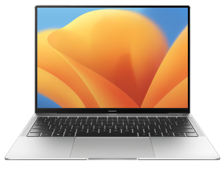
</p>
<p align="center">
<a href="https://consumer.huawei.com/it/support/laptops/matebook-x-pro/" target="_blank"></a>
<a href="https://consumer.huawei.com/it/support/laptops/matebook-x-pro/" target="_blank"></a>
<a href="LICENSE" target="_blank"></a>
<a href="https://github.com/profzei/Matebook-X-Pro-2018/releases" target="_blank"></a>
<a href="https://github.com/profzei/Matebook-X-Pro-2018/wiki" target="_blank"></a>
</p>


## ⚠️⚠️ Advertisement ⚠️⚠️


> **Warning**
- I'm sorry but I decided to remove all my releases: in this way I wanted to make it easier for people who have already copied what is on this site stating they made 'significant and unquestionable original changes' (instead of collaborating by suggesting pull requests)!
- I'll update this repo but only as my personal online report for how well this laptop could be turned as a full working hackintosh with full support for Thunderbolt devices
- **I thank all those who have supported me during these two years of work**, but seeing so many people copying (and then apologizing when confronted with a fait accompli!) templates + all the content of the related pages (even putting a link for a possible donation for their hard work!) + all the content of the ACPI folder of the EFI releases, **has deeply disgusted me**!


-----


#### This repository is currently compatible with macOS Ventura, Monterey, Big Sur and OpenCore 0.8.8
<div align="center">

|    macOS    |   |   Status   |
| :--- | :--- | :--- |
|    <a href="https://developer.apple.com/documentation/macos-release-notes/" target="_blank"></a>    |   `Stable` 13 (22A380)  »  13.2 (22D49) |   `Currently maintained`   |
|    <a href="https://developer.apple.com/documentation/macos-release-notes/" target="_blank"></a>   |   `Stable` 12.0.1 (21A559)  »  12.5.1 (21G83) |   `Compatible`   |
|    <a href="https://developer.apple.com/documentation/macos-release-notes/" target="_blank"></a>    |   `Stable` 11.0.1 (20B29)  »  11.6.8 (20G730) |   `Compatible`   |
|    <a href="https://developer.apple.com/documentation/macos-release-notes/" target="_blank"></a>   |   `Stable` 10.15 (19A583)  »  10.15.7 (19H15) |   `Compatible`   |
|    <a href="https://developer.apple.com/documentation/macos-release-notes/" target="_blank"></a>     |   `Stable` 10.14 (18A389)  »  10.14.6 (18G87) |   `No longer maintained`   |

</div>


If you find my work useful:
* please consider **giving** it **a star** ⭐️ to make it more visible.
* please consider **donating via PayPal**. [](https://www.paypal.com/cgi-bin/webscr?cmd=_donations&business=TSJHK3C2BSQN6&currency_code=EUR)


## Configuration 💻

<div align="center">

| Specifications      | Details                                          |
| :--- | :--- |
| Computer model      | Huawei Matebook X Pro 2018 Space Gray            |
| Processor           | Intel Core i7-8550U Processor @ 1.8 GHz          |
| Memory              | 8 GB LPDDR3 2133 MHz                             |
| Hard Disk           | LiteON SSD PCIe NVMe 512 GB [CA3-8D512]          |
| Integrated Graphics | NVIDIA GeForce MX150 / Intel(R) UHD Graphics 620 |
| Screen              | JDI 3k Display @ 3000 x 2000 (13.9 inch)         |
| Sound Card          | Realtek ALC256                                   |
| Wireless Card       | Intel Dual Band Wireless-AC 8265/8275            |
| Bluetooth Card      | Intel Bluetooth 8265/8275                        |

</div>

**Device Firmware** Bios version: `1.37`

<details>
<summary><strong>Benchmarks</strong></summary>

|   |  |
|:---:|:---:|
| System configuration | **GPU** - **OpenCL** Performance **4731** |

Compare with [these](https://browser.geekbench.com/v5/cpu/search?utf8=✓&q=MacBook+Pro+2018+i7+13-inch).

<p align="center">
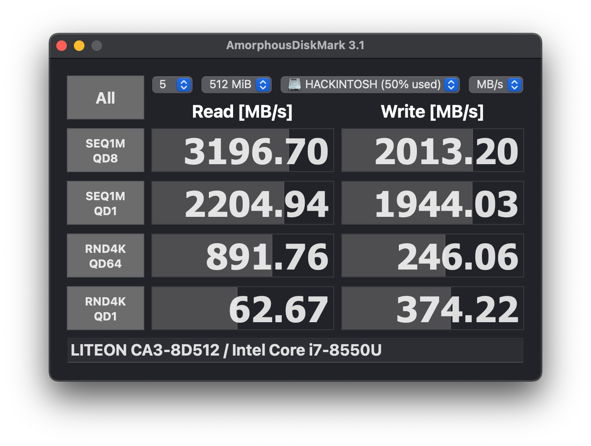
</p>

</details>

## Changelog

#### 2023 - January - 25
See [**Current status »**](Changelog.md)

<p align="center">
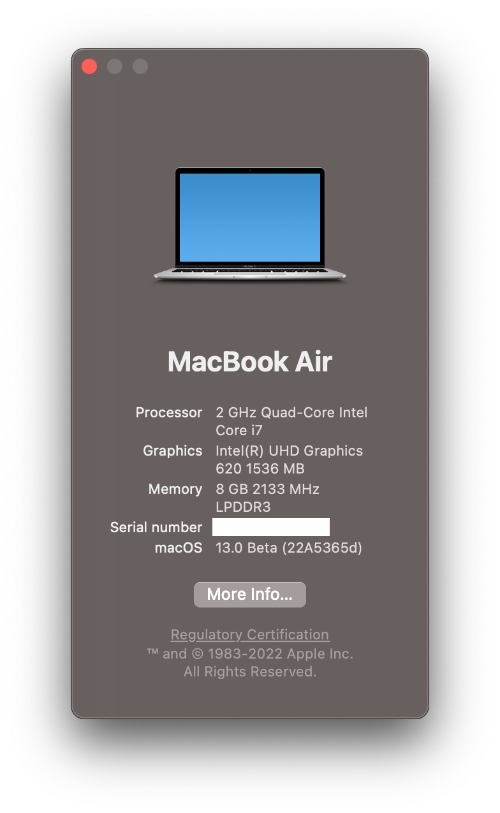
</p>


### DISCLAIMER ⚠️

- For best results, **read the entire README** before you start and follow the install instruction throughly.
- I am not responsible for any damages you may cause.
- **This is not a support forum**.
- Should you find an error or improve anything — whether in the config or in the documentation — please consider opening an issue or pull request.
- **Complete EFI packs** are available in the [**Releases »**](https://github.com/profzei/Matebook-X-Pro-2018/releases) page (please, refer to the rightside menu).
- **EFI** is configured with **Ventura**, **Monterey** or **Big Sur** in mind: if you are using it on **Catalina** (or Mojave), read the whole guide to make the necessary changes.
- **EFI** is configured for loading macOS **from internal NVMe SSD** both in dual-boot configuration with Windows and as a single OS (macOS installation on external SSDs are not taken into account)
- **EFI** is not suitable, as it is, to be used **for installing macOS**: please refer to Wiki section for a [**detailed guide for installing macOS »**](https://github.com/profzei/Matebook-X-Pro-2018/wiki/Installing-macOS).  

<p align="center">
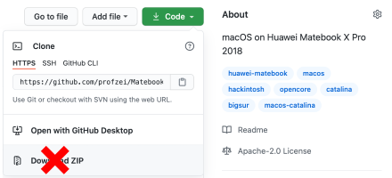
</p>

**This repository is for personal purposes only.**


## Introduction

This repo contains the files needed for getting macOS working on a **Huawei MateBook X Pro (2018 Edition)** laptop with OpenCore.
* This is intended to create a "fully" functional (as far as possible) hackintosh for the Huawei Matebook X Pro.
* The project can be considered **stable**.
* With each new release of macOS we need to resolve each new "minor issue" we run into. All of the steps I made to get to this point were a result of countless hours of reading along with trial and error, however I'm glad to say that **I learned a lot** in the meantime. I am by no means an expert so any effective help (suggestions, observations, ...) to tune this project is very appreciated!
* If you would like to get started with creating a hackintosh on your MBXP but have non experience, I would highly recommend following [**Dortania's OpenCore Install guide »**](https://dortania.github.io/OpenCore-Install-Guide/) and then returning here for troubleshooting or last improvements.


### Summary

- The **compatibility** is **very good** for the most part, most of the stuff works like it would on a real MacBook, including camera, audio, touchpad, iCloud services.
- The **experience** is **pleasant**, as the laptop is smooth and responsive under macOS Big Sur/Catalina.
- **Battery life** is **quite great** (from personal experience it **lasts from 8 to 10 hours** for light works depending on its age with a behaviour very similar to Windows 10 as shown in the macOS menu bar screenshots below).
- The **Intel WiFi** card is soldered onto the motherboard, which means it can't be replaced with a Broadcom one, but the Intel card is now **functional** (it is fine for most use cases).
    * With the latest `AirportItlwm.kext` even **Handoff** and **Continuity** features are working, but with a very limited support for AirDrop and Apple Watch unlocking (see [Changelog for OpenIntelWireless](https://github.com/OpenIntelWireless/itlwm/releases)).
    * For any issues about `AirportItlwm.kext` please refer first to [**OpenIntelWireless Troubleshooting page**](https://openintelwireless.github.io/itlwm/Troubleshooting.html#kernel-extension-loading-status) and then to [**OpenIntelWireless Gitter Page**](https://gitter.im/OpenIntelWireless/itlwm?utm_source=badge&utm_medium=badge&utm_campaign=pr-badge&utm_content=badge)

<p align="center">

</p>


### Generate your own SMBIOS Information

For privacy reasons, all SMBIOS information has been wiped out in the configuration file `EFI/OC/config.plist`. You need to generate your unique `SMBIOS` info by yourself (recommend to use [**CorpNewt's GenSMBIOS**](https://github.com/corpnewt/GenSMBIOS)), and inject them into your `config.plist`.
- With every **EFI update** you retrieve from [here](https://github.com/profzei/Matebook-X-Pro-2018/releases), please, remember to transfer **your Device details** under `PlatformInfo -> Generic` in your `config.plist`.
- For more details on **dual booting settings**, please, see also below [**OpenCore and Windows Activation**](https://github.com/profzei/Matebook-X-Pro-2018#status) notes.


## Status

- [x] **Intel(R) UHD 620** Graphics card  
- [x] **Intel(R) Wireless-AC** 8265/8275 & **Intel(R) Bluetooth**
- [x] **Power Management** with support for HWP (Intel Speed Shift & Intel SpeedStep)
- [x] **Sleep** and **Wake** (support for native macOS `hibernatemode3`)
- [x] **Hibernation** (support for native macOS `hibernatemode25` with `HibernationFixup.kext`)
- [x] **Battery support** with better memory access and integration of [Battery Information Supplement](https://github.com/acidanthera/VirtualSMC/blob/master/Docs/Battery%20Information%20Supplement.md)
- [x] **Automatic Backlight control** (with more granular levels)
- [x] Backlight shortcuts (F1 [brightness level down] - F2 [brightness level up])
- [x] Volume shortcuts (F4 [mute] - F5 [audio level down] - F6 [audio level up])
- [x] **Audio** for **Realtek ALC256** card (via `AppleALC.kext` and `layout-id 97`)
- [x] **Speakers** (4 Channels) & Internal Mic
- [x] **Headphone** jack [2 in 1]  (via `ALCPlugFix`)
- [x] **HDMI 2.0** up to two 4K @60 Hz monitors (via LSPCON)
- [x] **Native Color Profile** for Display JDI 3k
- [x] **TouchPad** (via `GPI0` interrupt mode) and **native macOS gestures**
- [x] Touchscreen
- [x] Updated support for LiteON SSD PCIe NVMe 
- [x] PCI Devices latency support and complete description for System Information app
- [x] **USB Ports Mapping** (Type-A & Type-C) with proper power levels
- [x] **Thunderbolt Port** (limited support)
- [x] HD Camera
- [x] NVRAM native support

#### BIOS Settings

- [x] `Main` -> `Thunderbolt Device` -> `Security Level` -> **No Security**
- [x] `Main` -> `Advanced` -> `PXE Device Enable` -> **Disable**
- [x] `Main` -> `Advanced` -> `Fingerprint Enable` -> **Disable**

<details>
<summary><strong>Notes</strong></summary>

1. **Intel Bluetooth** could not support some Bluetooth devices like some Bluetooth mouse since it is only a firmware injector; please, report any issues not here but only on [**OpenIntelWireless/IntelBluetoothFirmware Gitter Chat**](https://gitter.im/OpenIntelWireless/IntelBluetoothFirmware?utm_source=badge&utm_medium=badge&utm_campaign=pr-badge&utm_content=badge)
2. **Touchscreen support is disabled by default** since [release v. 1.8.0](https://github.com/profzei/Matebook-X-Pro-2018/releases). Why? It seems that all `VoodooI2C` versions after 2.4 are affected to a greater or lesser extent by `Multi_GPI0` issues.
The solution proposed so far by `VoodooI2C` developers is only a workaround and not a real fix: proposing to use the `GPI0` pinning for touchpad and polling method for touchscreen is not a real fix because this approach increases interrupts and causes a degrade in battery life. This being the case and not needing to use the touchscreen in my daily work, for the moment I have disabled this function pending improvements that can only come from `VoodooI2C` developers.
3. If you would like to **increase benchmark values** for your Intel UHD 620 Graphics card, you need to set `rps-control` key in `DeviceProperties -> PciRoot(0x0)/Pci(0x2,0x0)`, but keep in mind that `rps-control` property has been removed to lower down **GFX Request**:

```xml
...
<key>DeviceProperties</key>
<dict>
    <key>Add</key>
    <dict>
        ...
        <key>PciRoot(0x0)/Pci(0x2,0x0)</key>
        <dict>
            ...
            <key>rps-control</key>
            <data>AQAAAA==</data>
            ....
        </dict>
        ...
    </dict>
</dict>
...
```

</details>

<details>
<summary><strong>Notes: external Display support</strong></summary>

Intel UHD 620 Graphics card works well with external display from both USB type-C ports.
- Suggestion: prefer **USB type-C to DisplayPort** cable over USB type-C to HDMI one where possible
- Removed for `PciRoot(0x0)/Pci(0x2,0x0)` the key `force-online` (which was set to `<data>AQAAAA==</data>`). Why?
    - With latest `WhateverGreen` releases our available connector types are 1 LVDS (internal monitor) and 2 DP; using an external monitor connected with a USB C-type to DP cable I verified the correct recognition and functioning of my BenQ PD2500Q even after the system wake-up. This `force-online` key could instead be useful for connections using a USB-C type to HDMI cable.
    - Eliminating this key reduces tons of warning messages like `[IGFB] [ERROR] [AGDC] Failed with status -536870212 for stream access aux` in system log during boot phase: that warning is correct/normal since it reports that the display is not connected for the remaining ports (i.e. `FB1` and `FB2` in our case using only `FB0` i.e. internal display); eliminating those warnings reduces log-file size (in debug-mode) from 2.6 to 1.6 MB thus reducing slightly boot loading time. [Reference](https://github.com/acidanthera/bugtracker/issues/1318)
- `force-online` and `force-online-framebuffers` work around (possible) HDMI black screen issues after waking from sleep

```xml
...
<key>DeviceProperties</key>
<dict>
    <key>Add</key>
    <dict>
        ...
        <key>PciRoot(0x0)/Pci(0x2,0x0)</key>
        <dict>
            ...
            <key>force-online</key>
            <data>AQAAAA==</data>
            <key>force-online-framebuffers</key>
            <data>Af////////8=</data>
            ....
        </dict>
        ...
    </dict>
</dict>
...
```

</details>


<details>
<summary><strong>Notes: NVMe SSD support</strong></summary>

1. Very rarely some users reported the following kernel panic after sleep:
```
panic(cpu 0 caller 0xffffff800b6ce860): nvme: "Fatal error occurred. CSTS=0xffffffff
...
```
It's certainly a `NVMe` error, but it is not due to **EFI** released in the present repo:
- it may be due to the power management of **your NVMe device** (mine is a **LiteON SSD PCIe NVMe 512 GB [CA3-8D512]**)
- reference to this issue is in **acidanthera/bugtracker#1193** [IGP causes NVMe Kernel Panic CSTS=0xffffffff](https://github.com/acidanthera/bugtracker/issues/1193)

In case you run into such an issue, it is recommended adding `forceRenderStandby=0` boot-args in your `config.plist` to disable `RC6 Render Standby`.

2. If your laptop has a **Samsung PM981 NVMe SSD** or **any unsupported SSD** listed in [dortania/bugtracker#192](https://github.com/dortania/bugtracker/issues/192), then it's obviously **not supported here**. I have no way to make my **EFI** work on broken `IONVME` compatibility SSDs.

Obvious solutions:
- buy another (internal) NVMe SSD
- or install macOS on an external SSD drive

Even if your macOS installed on an external SSD drive, you need to add a new ACPI patch to **disable** PM981 (or other **non-supported NVMe** SSDs) **detection on macOS**:

```asl
DefinitionBlock ("", "SSDT", 2, "HUAWEI", "_DRP05", 0)
{
	External (OSDW, MethodObj)

    External (_SB_.PCI0.RP05, DeviceObj)

    Scope (\_SB.PCI0.RP05)
    {
        OperationRegion (DE01, PCI_Config, 0x50, One)
        Field (DE01, AnyAcc, NoLock, Preserve)
        {
                ,   1, 
                ,   3, 
            DDDD,   1
        }
    }

    Scope (\)
    {
        If (OSDW ())
        {
            \_SB.PCI0.RP05.DDDD = One
        }
    }
}
``` 

</details>

<details>
<summary><strong>Notes: Bios version</strong></summary>

Starting from BIOS version `1.33` and newer, **Huawei** added to default `DSDT.aml` a new method, called `_QBF`, related to **battery thermal management**.

As default, in `config.plist` in `ACPI -> Add` section it has been added `SSDT-BIOS.aml` (as enabled) for introducing method `_QBF` also for BIOS versions up to `1.30`: proper BIOS version check has been implemented.
</details>

<details>
<summary><strong>Notes: OpenCore and Windows Activation</strong></summary>

**For dual-booting systems, Windows Activation may fail due to different hardware UUID generated by OpenCore**
- According to [OpenCore Official Configuration](https://github.com/acidanthera/OpenCorePkg/blob/master/Docs/Configuration.pdf), you are highly recommended to inject the **original Windows system UUID** to `PlatformInfo -> Generic - >SystemUUID` in `EFI/OC/config.plist`: run `wmic csproduct get UUID` command in Windows PowerShell app 
</details>

<details>
<summary><strong>Notes: AirportItlwm support in macOS Catalina (or Mojave)</strong></summary>

If you use this release in **macOS Catalina** you need to make the following changes in the `config.plist` to make `AirportItlwm.kext` support active:
- `DmgLoading` set to `Signed`
- `SecureBootModel` set to `Default`
</details>

<details>
<summary><strong>Notes: Thunderbolt support</strong></summary>

As reported in [NotebookCheck review](https://www.notebookcheck.net/Huawei-has-pulled-a-Dell-the-MateBook-X-Pro-uses-a-gimped-Thunderbolt-3-port.316550.0.html) our Matebook X pro (2018) is utilizing only half the PCIe lanes for its single Thunderbolt 3 port (TB). Thus, its PCIe x2 Thunderbolt 3 port is only capable of providing a maximum of 20 Gbps instead of 40 Gbps when compared to a standard Thunderbolt 3 port with PCIe x4 lanes.

The connector type is Usb-C and it can do multiple protocols (TB, USB 2/3/3.1, DP, etc...) with different backing controllers. The problem on Hackintoshes is mostly about TB on Usb-C, because the firmware and power management of Apple's TB-controllers works entirely different than those for other OS'es. So even if it's the same hardware found on Windows laptops, they don't "just work" because of the different firmware.

The ACPI-part for handling Thunderbolt 3 port and its power management has been implemented:
- it enables not only the `PCIe-to-PCIe` bridge-mode of the TB controller but also the **native drivers** which make it possible to completely poweroff the controller after using the TB port, saving battery life and prevent the controller from preventing the CPU goes into deeper C-State
- the ICM is disabled on boot to let OSX' drivers take over the job
- the TB port works when any device is plugged into it at the boot time: this means **no hot-plug**
- the TB 3 XHC Controller is working fine when any device is plugged into it at boot time
- the TB drivers are loaded even if no device is plugged into it at boot time
- the TB 3 XHC Controller bus is loaded even if no device is plugged into it at boot time


<p align="center">
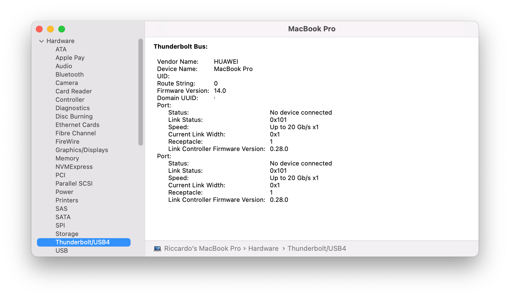
</p>

<p align="center">
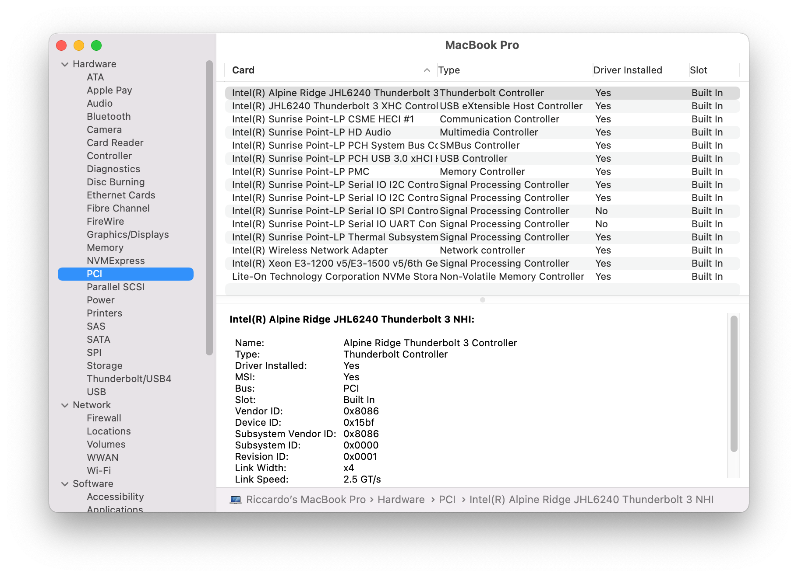
</p>

<p align="center">
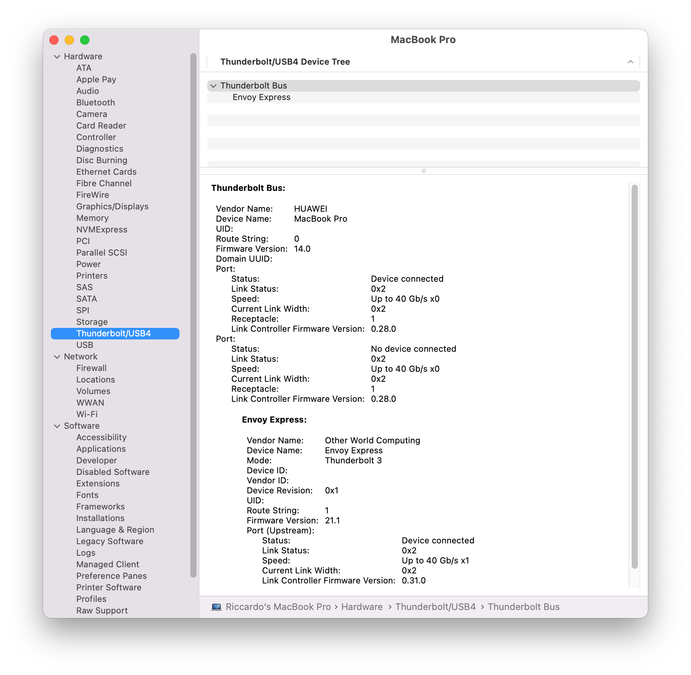
</p>


Since I was given an **OWC Envoy Express** Thunderbolt 3 Controller **is enabled** in my default `config.plist`.

Steps for disabling support for Thunderbolt controller (`\_SB.PCI0.RP09`):
- disable `SSDT-JHL6240-AR2.aml`
- enable `SSDT-DTB3.aml`
- disable all `TB3: *` binary patches


Real-time power management for Thunderbolt controller with Discrete GPU (NVIDIA GeForce MX150) removed at PCI level are shown:

<p align="center">

</p>

<p align="center">

</p>

For reference, see [Thunderbolt 3 Fix](https://osy.gitbook.io/hac-mini-guide/details/thunderbolt-3-fix-part-3) and [ThunderboltPatcher](https://github.com/osy86/ThunderboltPatcher) for related attempts to fix TB by patching its firmware.
</details>

<details>
<summary><strong>What's not working due to Incompatible Hardware</strong></summary>

- [ ] **Discrete graphics card** (NVIDIA GeForce MX150) is not working, since macOS doesn't support Optimus technology
	- ~~Have used `SSDT-DDGPU.aml` to disable it in order to save power.~~
    - Removed it at PCI level reducing time for putting machine to sleep and for resuming it from sleep (i.e. laptop is more reactive during these phases!)
    - `\_SB.PCI0.RP01` is not present anymore in IORegistryExplorer tree (this is proof for having disabled GPU at PCI level!)

<p align="center">
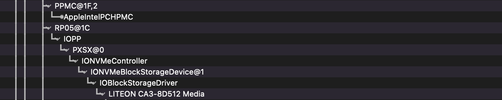
</p>

- [ ] **Fingerprint sensor** is not working
	- Fingerprint readers on Macbooks are managed by T2 chip which has not been very throughly reverse engineered yet
	- Have used `SSDT-XHC.aml` to disable it (in order to save some power).
</details>


## Bootloader Firmware
- Default bootloader: `OpenCore 0.8.8` [Official release](https://github.com/acidanthera/OpenCorePkg/releases).
    - Support macOS 10.15 ~ latest macOS release
    - As theme for `OpenCanopy`, a cleaner version with custom graphics has been provided by [**@R-Teer**](https://github.com/R-Teer)
    - See more info in [Wiki section](https://github.com/profzei/Matebook-X-Pro-2018/wiki/Converting-from-Clover-to-OpenCore) about migration from Clover.
- No longer maintained: Clover `r5118` [Official release](https://github.com/CloverHackyColor/CloverBootloader/releases) ~~`r5103` [Dids release](https://github.com/Dids/clover-builder/releases)~~


## Install Settings

If you try to use [**latest EFI Release**](https://github.com/profzei/Matebook-X-Pro-2018/releases) for installing macOS onto your Matebook X Pro, you'll realize it didn't work... **Why**?

Because our EFI is very fine tuned to overcome some InsydeH2O firmware's limits and therefore it is not suitable for installation process as it is.

Please refer to Wiki section for a [**detailed guide for installing macOS**](https://github.com/profzei/Matebook-X-Pro-2018/wiki/Installing-macOS).


## Post - Install Settings
<details>
<summary><strong>Enable Tap (with one finger) for Touchpad</strong></summary>

Starting from [VoodooI2C v. 2.4.1](https://github.com/VoodooI2C/VoodooI2C/releases), the **click down** action is emulated to **force touch**, which causes the failure of click down and drag gestures.

For example, you can turn off `Force Click` in `System Preferences -> Trackpad` or choose three finger drag in `System Preferences -> Accessibility -> Mouse & Trackpad -> Trackpad Options`

Suggested configuration:
<p align="center">
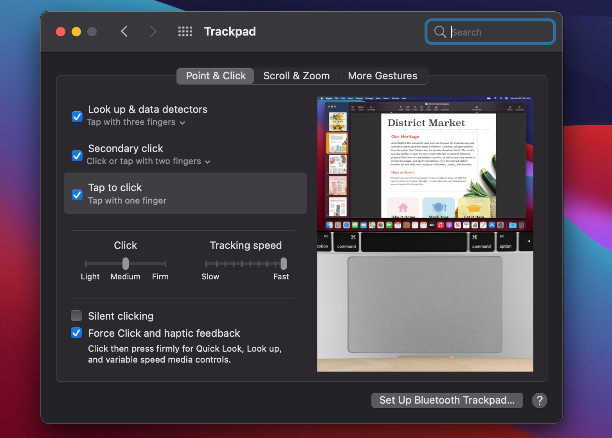
</p>

</details>

<details>
<summary><strong>Enable Apple Services</strong></summary>

To use iMessage and other Apple services, you need to generate **your own** serial numbers. This can be done using [CorpNewt's GenSMBIOS](https://github.com/corpnewt/GenSMBIOS):
- If **Serial numbers** have been correctly generated, these services (iMessage, FaceTime, ...) should work for you
- If not, [clean up](https://dortania.github.io/OpenCore-Post-Install/universal/iservices.html#clean-out-old-attempts) and generate new serial number for your **SMBIOS**.

Default **SMBIOS** settings of this repo is `MacBookPro15,2` ~~`MacBookPro14,1`~~ ~~`MacBookPro16,3`~~
1. Launch `Terminal` app
2. Copy the following script, paste it into the `Terminal` window, then press `Enter`
   ```bash
   git clone https://github.com/corpnewt/GenSMBIOS && cd GenSMBIOS && ./GenSMBIOS.command 
   ```
3. Type `1` for downloading/updating `MacSerial` script
4. Type `3`, then press `Enter`
5. Type `MacBookPro15,2 10`, then press `Enter`
6. Then, go [Apple Check Coverage page](https://checkcoverage.apple.com/) to check your generated serial numbers. If the website tells you that the serial number is **not valid**, that is fine. Otherwise, you have to generate a new set.
7. Next you will have to copy the following values to your `config.plist`:
   - Serial Number -> `PlatformInfo/Generic/SystemSerialNumber`
   - Board Number -> `PlatformInfo/Generic/MLB`
   - SmUUID -> `PlatformInfo/Generic/SystemUUID`. Reboot and Apple services should work.

```xml
<key>PlatformInfo</key>
<dict>
    ...
    <key>MLB</key>
    <string>M0000000000000001</string>
    ...
    <key>SystemSerialNumber</key>
    <string>W00000000001</string>
    ...
    <key>SystemUUID</key>
    <string>00000000-0000-0000-0000-000000000000</string>
    ...
</dict>
```

8. If they don't work, follow this [in-depth guide](https://dortania.github.io/OpenCore-Post-Install/universal/iservices.html). It goes deeper into clearing **Keychain** (missing this step might cause major issues), and much more.

</details>

<details>
<summary><strong>Sleep & Hibernation settings</strong></summary>

On a **MacBook** there are some stages of sleep:
- **Sleep** or memory sleep: this is what happens when you let the computer idle for some time (power to display is turned off);
- **Standby** or Safe Sleep: memory state is written to RAM and after a certain period memory power could be turned off;
- **Hibernation**: all power is off and all state has been written to a disk image (`/private/var/vm/sleepimage`); you know this has happened if when you open the lid you see `OpenCanopy` boot picker, and then see a progress bar while it is loading state from disk.

<p align="center">
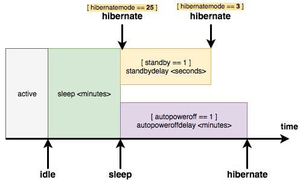
</p>

We could summarize **sleep settings** as the following:
1. if `sleep == 0`, the computer will not sleep or hibernate any more
    - For MacBooks, the effective setting automatically changes whenever the charger is plugged in:
        * Normally, `sleep` minutes are simply equal to `displaysleep` minutes, which you can set in `System Preferences -> Energy Saver`
        * But under the `Power Adapter` tab, checking `Prevent computer from sleeping automatically when the display is off` option will override sleep minutes to 0
2. if `standby == 1` **and** `hibernatemode == 3`, the computer will **wait** another `standbydelay` seconds before really entering **hibernation**
3. `autopoweroff` is just an extra implementation to fulfill regulatory requirement and has the same impact equivalent to **2)**
4. either **2)** or **3)** takes effect if one of them is reached at first
5. if `standby == 1` **and** `hibernatemode == 25`, the computer will enter **hibernation immediately** after `sleep` minutes.

For our Huawei Matebook X Pro **sleep/standby** function works flawlessly (both via software and via clamshell) like **hibernation** (suspend to disk or S4 sleep). 

In order to get automatic sleep working properly like real Macs, the following settings are **mandatory**: 
```
sudo pmset -a powernap 0 
sudo pmset -a proximitywake 0
sudo pmset -a tcpkeepalive 0
sudo pmset -a womp 0
```
- `powernap` will wake up the system from time to time to check mail, make Time Machine backups, etc...
- `proximitywake` can wake your machine when an iDevice is near.
- `tcpkeepalive` has resolved periodic wake events after setting up iCloud.
- `womp` is wake on lan.

**After every update, ALL these settings should be reapplied manually!**

Suggested configuration in `System Preferences -> Bluetooth -> Advanced` for **Bluetooth devices** for avoiding random wake events during sleep:

<p align="center">
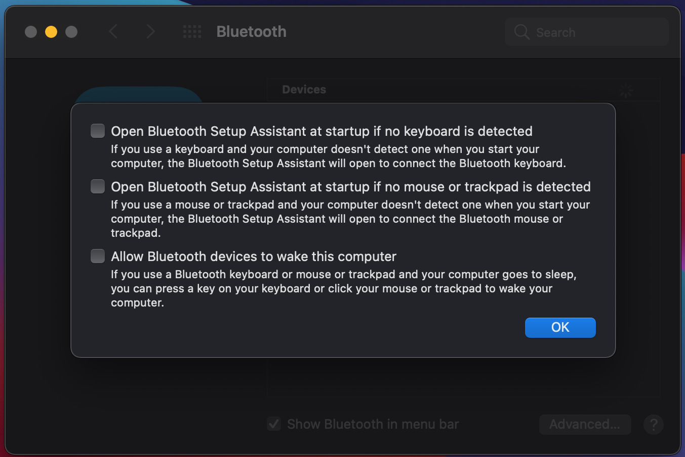
</p>

Default macOS setting for MacBooks is **hibernatemode 3** i.e. **sleep mode**:
- `standby` causes kernel power management to automatically hibernate a machine after it has slept for a specified time period
- `standbydelay` specifies the delay, in seconds, before writing the hibernation image to disk and powering off memory for `standby`

Concretely, the way I like to configure **my** Matebook X Pro is for it to do **first** a standby-only sleep, so that it quickly goes to sleep, with the chance of a very quick wake-up phase, and **then**, if I leave the laptop sleeping for a certain number of hours (say in my case 1 hour), it could write the RAM contents to disk and power off the computer, so as to save battery in case of an extended sleep (entering therefore hibernation phase). 

In order to get this configuration, I suggest the following settings:
- add to `config.plist` in `NVRAM -> Add -> 7C436110-AB2A-4BBB-A880-FE41995C9F82 -> boot-args` section the value `hbfx-ahbm=129` which controls auto-hibernation feature introduced by `HibernationFixup` kext (in particular it is an arithmetic sum of `EnableAutoHibernation` = 1 and `DisableStimulusDarkWakeActivityTickle` = 128 flags) [Reference](https://github.com/acidanthera/HibernationFixup) for deeper insight
- run in Terminal
```
sudo pmset -a standby 1 
sudo pmset -a hibernatemode 3
sudo pmset -a standbydelaylow 3600
sudo pmset -a standbydelayhigh 3600
```
- reboot your laptop

**Note**: Keep in mind that, with the above settings, after 3600 seconds the laptop wake up itself only partially (display remains off) for switching from standby sleep to hibernation sleep: it is standard behaviour since all Macs use **maintenance wake** (dark wake - display remains off) to switch laptop from regular sleep into hibernation. It is not an issue! [Reference](https://github.com/acidanthera/bugtracker/issues/1810#issuecomment-939727817) 

<p align="center">

</p>

**Note**: **Hibernation mode** can be enabled only via console command `sudo pmset -a hibernatemode 25` and is fully supported by Matebook X Pro (obviously using `HibernationFixup` kext). 

If, however, you would like to disable it, then
```
sudo pmset -a hibernatemode 0
sudo pmset -a autopoweroff 0
sudo rm -rf /private/var/vm/sleepimage
sudo touch /private/var/vm/sleepimage
sudo chflags uchg /private/var/vm/sleepimage
```

You can verify your power settings by typing in terminal `sudo pmset -g live` .

If you ever want to reset these settings: `sudo pmset -a restoredefaults`

About power consumption, [HWMonitor](https://github.com/kzlekk/HWSensors/releases) reports for the idle state both before and after sleep phase the same value for "CPU package total" (0.65-0.70 W). Sleep discharge rate is about 1% every 4:30 hours (during night).
</details>

<details>
<summary><strong>Power Management settings</strong></summary>

With `CPUFriend.kext` and `SSDT-PM.aml` we achieved a **very good power management on battery** for [Intel Core i7-8550U](https://ark.intel.com/content/www/us/en/ark/products/122589/intel-core-i7-8550u-processor-8m-cache-up-to-4-00-ghz.html) (without compromising performance) as reported in the following macOS menu bar screeshots:
- a mean 10% rate discharge for hour
- temperature range from 30°C to 40°C for light/medium CPU workload
- a mean `CPU package total` value of about 0.65-0.70 W for idle state

<p align="center">


</p>

Suggested configuration for **Battery** and **Power Adapter** settings in `System Preferences -> Battery` are reported in the following:

<p align="center">
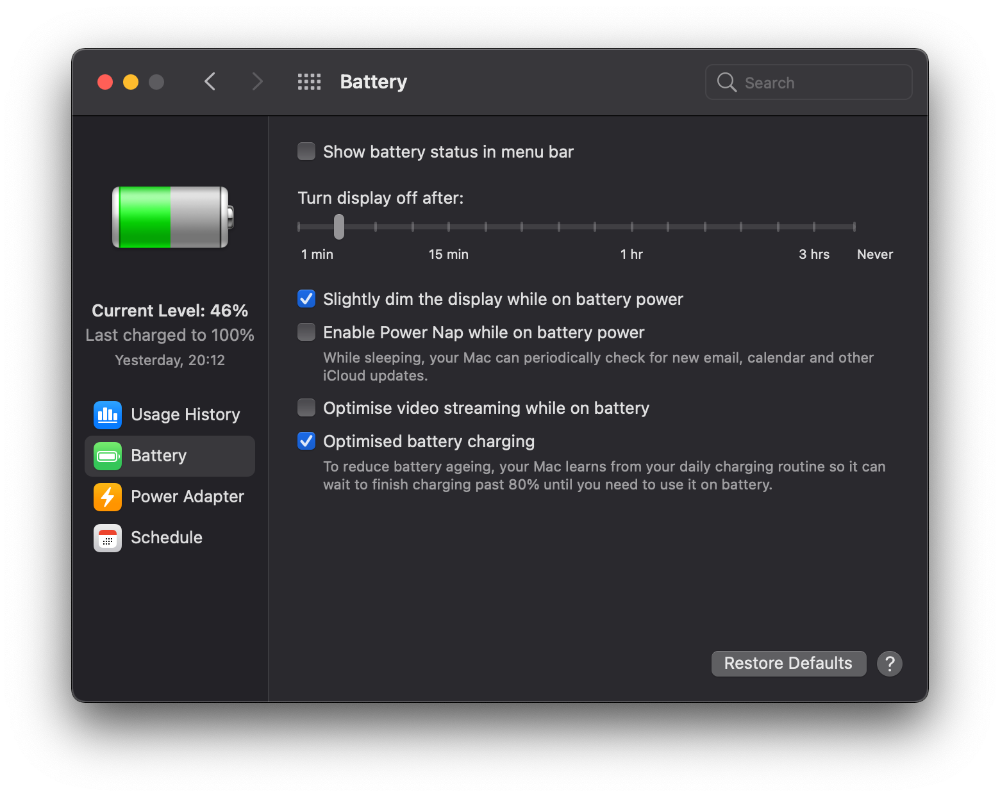
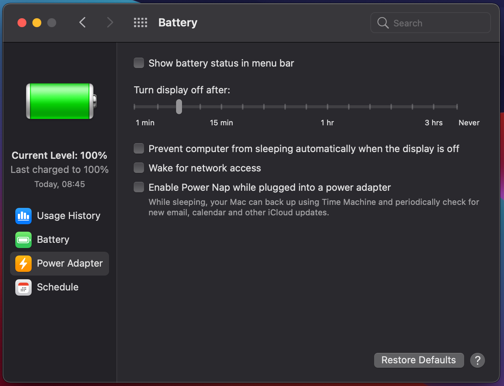
</p>

It is also suggested to force `pci-aspm-default` property for activating on macOS **Active-State Power Management** for `PCIe` devices like:
- `PciRoot(0x0)/Pci(0x1c,0x0)` which is PCI-Express bus for **nVIDIA card**
- `PciRoot(0x0)/Pci(0x1c,0x4)` which is PCI-Express bus for **NVMe SSD** (LiteOn in my case...)
- `PciRoot(0x0)/Pci(0x1d,0x0)` which is PCI-Express bus for **Thunderbolt Controller**
and therefore optimize power consumption for these buses.

We need to point out that macOS is obviously designed for working well/optimally only on Mac hardware, so in our hackintoshes it could be advisable to force a such property whenever possible...

```xml
<key>PciRoot(0x0)/Pci(0x1c,0x0)</key>
    <dict>
        ...
        <key>pci-aspm-default</key>
        <data>AgAAAA==</data>
        ...
    </dict>
    ...
<key>PciRoot(0x0)/Pci(0x1c,0x4)</key>
    <dict>
        ...
        <key>pci-aspm-default</key>
        <data>AgAAAA==</data>
        ...
    </dict>
    ...
<key>PciRoot(0x0)/Pci(0x1d,0x0)</key>
    <dict>
        ...
        <key>pci-aspm-default</key>
        <data>AgAAAA==</data>
        ...
    </dict>
```
**This feature is working well on my system**. It has not been inserted as default in `config.plist` for helping people to install [EFI releases](https://github.com/profzei/Matebook-X-Pro-2018/releases) on Huawei Matebook X Pro **lacking a discrete nVIDIA GPU** (typically with i5 architecture and Intel only GPU). [Reference](https://github.com/profzei/Matebook-X-Pro-2018/issues/186#issuecomment-947863820)
</details>

<details>
<summary><strong>Activate Surround Sound via MIDI</strong></summary>

By default macOS only uses 2 out of our MBXP 4 speakers: if you want to achieve a **surround sound system** on macOS, you need to create an **Aggregate Device**. But then macOS does not allow you to control the volume of the sound: yes, it is real and is a general behaviour of MacBookPro machines.

For a detailed guide on how to activate surround sound via MIDI on internal speakers and native audio shortcuts, see [Wiki section](https://github.com/profzei/Matebook-X-Pro-2018/wiki/Activate-Surround-Sound-via-MIDI-on-internal-speakers) 
</details>

<details>
<summary><strong>Fix Headphone jack switch</strong></summary>

Refer to my custom [**ALCPlugFix**](https://github.com/profzei/Matebook-X-Pro-2018/tree/master/ALCPlugFix) instructions for properly setting/fixing headphone jack switch for Matebook X Pro.
</details>

<details>
<summary><strong>Undervolt using VoltageShift</strong></summary>

Undervolting is a great way to maximise performance, lower power consumption and reduce temperatures.

For a detailed guide on how to undervolt our MBXP using `VoltageShift` from the EFI folder instead of disabling SIP, see [Wiki section](https://github.com/profzei/Matebook-X-Pro-2018/wiki/Undervolt-via-VoltageShift) 
</details>


## Optional Settings
<details>  
<summary><strong>Add custom shortcuts to F7, F9 & F10 hotkeys</strong></summary>

With the latest update and inclusion of the new `SSDT-KBD.aml` we are now able to reconfigure the shortcuts to custom settings.

For a detailed guide on how to enable original `F7`, `F9` & `F10` hotkeys using native **Automator** app, please see [Wiki section](https://github.com/profzei/Matebook-X-Pro-2018/wiki/Add-custom-shortcuts-to-Fn-hotkeys).

Otherwise, you can follow these suggestions [credit **@R-Teer**]:
- There are various freeware software tools to achive this such as [Karabiner Elements](https://karabiner-elements.pqrs.org/) or [Ukelele](https://software.sil.org/ukelele/).
- Personally I use the application [BetterTouchTool](https://folivora.ai/), which is paid but incredibly useful and allows custom trackpad gestures amongst other features.
- My current settings are as follows:

<p align="center">

</p>

</details>

<details>  
<summary><strong>Fix keyboard layout</strong></summary>

If you have a keyboard that is not identified correctly, i.e. some keys are swapped (common if you don't have a US layout), you can force macOS to re-detect keyboard layout by deleting the .plist file where settings are stored running the following command:
```
sudo rm /Library/Preferences/com.apple.keyboardtype.plist
```
Then reboot: macOS will prompt a guided process to identify your keyboard.

</details>

<details>  
<summary><strong>Increase Launchpad icons number</strong></summary>

By default (for a 13 inch MacBook Pro), the Launchpad shows the icons in 5×7 format.

Type in Terminal the following commands:
```
defaults write com.apple.dock springboard-rows -int 6
defaults write com.apple.dock springboard-columns -int 9;killall Dock
```
Relaunch the Launchpad to see the icons are changed now.

Finally you can revert to the default setting with the following commands:
```
defaults delete com.apple.dock springboard-rows
defaults delete com.apple.dock springboard-columns
defaults write com.apple.dock ResetLaunchPad -bool TRUE;killall Dock
```
(**Warning**: the last command also will remove any custom folders you have created)
</details>


<details>
<summary><strong>Monitor temperatures and power consumption with HWMonitor</strong></summary>

[**HWMonitor**](https://github.com/kzlekk/HWSensors/releases) is relatively old and no longer supported, but it gets the job done.
</details>

<details>  
<summary><strong>Make macOS zsh Terminal colorful</strong></summary>

The **default macOS Terminal** looks very lame since it lacks in visibility: things should be colorful like Ubuntu. 
In the following steps, a proper solution for that is given **without installing any custom theme**:
- Choose any black theme first as the color combination of my snippet is dark theme friendly
- Open **Terminal** and type:
```
cd
touch zshrc
open zshrc
```
- Append the following code in the file:
```
export CLICOLOR=1
export LSCOLORS=GxBxCxDxCxegedabagaced
```
- Save the file and quit your default editor
- In **Terminal** type:
```
mv zshrc .zshrc
```
- Quit **Terminal** (`cmd + q`)
- Now open a new **Terminal** window and the changes will be reflected

#### How did the customization worked?

By setting `CLICOLOR=1` you are enabling colors.

`LSCOLORS` is the variable where you will define which file should display what color: it is used to color the directory and file list. 
It provides you 11 positions, each with `FB` (foregroundColor backgroundColor) combination. Thus it contains 22 characters. Below is the details of which position means what:
1. directory
2. symbolic link
3. socket
4. pipe
5. executable
6. block special
7. character special
8. executable with setuid bit set
9. executable with setgid bit set
10. directory writable to others, with sticky bit
11. directory writable to others, without sticky

The colors for each position are placed as `FB` format; below is the list which color means what:
- `a`: black
- `b`: red
- `c`: green
- `d`: brown
- `e`: blue
- `f`: magenta
- `g`: cyan
- `h`: light grey
- `A`: bold black, usually shows up as dark grey
- `B`: bold red
- `C`: bold green
- `D`: bold brown, usually shows up as yellow
- `E`: bold blue
- `F`: bold magenta
- `G`: bold cyan
- `H`: bold light grey; looks like bright white
- `x`: default foreground or background

The colors mentioned above are ANSI colors, but according to the version of your macOS or terminal, they may differ a little.
</details>

<details>  
<summary><strong>Remove Eject icon from macOS menu bar</strong></summary>

Apple no longer sells any Mac with a built-in optical drive, but many users still rely on CDs, DVDs, and Blu-ray discs for both work and entertainment.

**How do I get rid of this icon?**
- Press and hold the `Apple/Command` key
- Click and drag the `Eject` menu icon off the menu bar
- Once you start dragging the `Eject` icon, you can release the `Apple/Command` key
- When you see a small "x" icon appear, then release the mouse button: it will remove the `Eject` icon from your menu bar.

**How to add Eject icon to menu bar**
- From the macOS desktop, make sure *Finder* is the active application and then select `Go -> Go to Folder` from the menu bar. Alternatively, you can use the keyboard shortcut `Shift-Command-G`
- Enter the following location: `/System/Library/CoreServices/Menu Extras/`
- Find and double-click on `Eject.menu`
</details>

<details>  
<summary><strong>Dual Booting: fix Windows time</strong></summary>

Windows uses local time by default while macOS uses universal time. You can switch Windows 
to use universal time.
Open up a command prompt in Windows as an administrator and copy and paste this in:
```
reg add "HKEY_LOCAL_MACHINE\System\CurrentControlSet\Control\TimeZoneInformation" /v RealTimeIsUniversal /d 1 /t REG_QWORD /f
```
That will make Windows use universal time instead of local time.
Then update your clock via the built-in internet time setting to update the time.
</details>

<details>
<summary><strong>Terminal Commands</strong></summary>

#### --> macOS specific

**Disable Gatekeeper**:
```
sudo spctl --master-disable
```

**Disable Logging**:
```
sudo rm /System/Library/LaunchDaemons/com.apple.syslogd.plist
```

**Make dock animation faster and without delay**:
```
defaults write com.apple.dock autohide-delay -float 0
defaults write com.apple.dock autohide-time-modifier -float 0.5
killall Dock
```

**Show all Files in Finder**:
```
defaults write com.apple.finder AppleShowAllFiles -bool true
killall Finder
```

**Show User Library in Big Sur**:
```
setfile -a v ~/Library
chflags nohidden ~/Library
```

**Sidecar**:
```
defaults write com.apple.sidecar.display AllowAllDevices -bool true
defaults write com.apple.sidecar.display hasShownPref -bool true
```

**Update PreBoot Volume**:
```
sudo diskutil apfs updatePreboot /
```

#### --> Hackintosh specific

**Check working `XCPM` configuration**:
```
sysctl machdep.xcpm.mode
   // If it returns '1', then it means the XCPM is active.
```

**Check if the `X86PlatformPlugin.kext` is loaded**:
```
kextstat|grep -y x86plat
```

**Check loaded/injected kexts**:
```
kextstat -kl | awk '!/com\.apple/{printf "%s %s\n", $6, $7}'
```

**Debug ACPI Hotpatches**:
```
log show --predicate "processID == 0" --start $(date "+%Y-%m-%d") --debug | grep "ACPI"
```

**Debug Sleep/Wake-up issues**
- Clean all the logs: `sudo log erase --all`
- Enter sleep mode: `pmset sleepnow`
- Wait a few minutes so the logs can collect some data and then wake up the machine
- Run `log show --style syslog | fgrep "[powerd:sleepWake]"`
```
pmset -g assertions
pmset -g
```

Check sleep log: `pmset -g log | egrep '\b(Sleep|Wake|Start)\s{2,}'`

**Save last boot info:**
```
log show --predicate 'process == "kernel"' --style syslog --source --debug --last boot > sys_log.txt
```

</details>

## Update tracker

<div align="center">

| Item | Version | Remark |
| :--- | :--- | :--- |
| MacOS | 13.2 | |
| [OpenCore](https://github.com/acidanthera/OpenCorePkg/releases) | 0.8.8| Default Bootloader |
| [Lilu](https://github.com/acidanthera/Lilu/releases) | 1.6.3 | Kext/process/framework/library patcher |
| [WhateverGreen](https://github.com/acidanthera/whatevergreen/releases) | 1.6.3 | Handle Graphics card |
| [AppleALC](https://github.com/acidanthera/AppleALC/releases) | 1.7.8 | Handle/fix onboard audio |
| [CodecCommander](https://github.com/Sniki/EAPD-Codec-Commander/releases) | 2.7.2 | Fix headphone audio switch |
| [CPUFriend](https://github.com/acidanthera/CPUFriend/releases) | 1.2.6 | Power management |
| [HibernationFixup](https://github.com/acidanthera/HibernationFixup/releases) | 1.4.7 | Handle hibernate status |
| [IntelBluetoothFirmware](https://github.com/OpenIntelWireless/IntelBluetoothFirmware/releases) | 2.2.0 stable | Handle Bluetooth |
| [AirportItlwm](https://github.com/OpenIntelWireless/itlwm/releases) | 2.2.0 alpha | Handle native Wi-Fi card |
| [BlueToolFixup](https://github.com/acidanthera/BrcmPatchRAM/releases) | 2.6.4 | Fix Bluetooth for macOS 12+ |
| [NullEthernet](https://bitbucket.org/RehabMan/OS-X-Null-Ethernet/downloads/) | 1.0.6 | Fake Ethernet card |
| [NoTouchID](https://github.com/al3xtjames/NoTouchID/releases) | 1.0.4 | Disable TouchID |
| [NVMeFix](https://github.com/acidanthera/NVMeFix/releases) | 1.1.0 | Fix for NVMe SSDs |
| [RestrictEvents](https://github.com/acidanthera/RestrictEvents/releases) | 1.0.9 | Block unwanted processes |
| [VoodooI2C](https://github.com/alexandred/VoodooI2C/releases) | 2.7.1 | Handle I2C device |
| [VoodooI2CHID](https://github.com/alexandred/VoodooI2C/releases) | 2.7.1 | Touchpad I2C satellite |
| [VoodooPS2Controller](https://github.com/acidanthera/VoodooPS2/releases) | 2.3.3 | Enable keyboard, alternative trackpad driver |
| [VirtualSMC + plugins](https://github.com/acidanthera/VirtualSMC/releases) | 1.3.0 | SMC chip emulation |
| [USBInjectAll](https://github.com/daliansky/OS-X-USB-Inject-All/releases) | 0.7.6 | Inject USB ports |
| [VoltageShift](https://github.com/sicreative/VoltageShift) | 1.25 | Undervoltage tool |

</div>

## Dev. Notes

In [**Wiki section**](https://github.com/profzei/Matebook-X-Pro-2018/wiki) are stored some significant/**advanced technical guides**.

<details>
<summary><strong>USB port mapping scheme</strong></summary>

Proper `SSDT-XHC.aml` is used for USB Host Controller (XHCI-Device-ID: `<2f 9d 00 00>`): this file is configured to map only the necessary ports (tested with IOReg) with the correct connector type and prevent it from shutdown issues.

| Port      | Address               | Physical Location                                         | Internal/External |
| :--- | :--- | :--- | :--- |
| HS01/SS01 | `00000001`/`0000000D` | Left Port type-C (Power Source) - next to 3.5mm jack port | E                 |
| HS02/SS02 | `00000002`/`0000000E` | Right Port type-A                                         | E                 |
| HS03      | `00000003`            | Left Port type-C Thunderbolt                              | E                 |
| HS05      | `00000005`            | Bluetooth USB Port                                        | I                 |
| HS07      | `00000007`            | Integrated HD Camera module                               | I                 |

</details>

<details>
<summary><strong>Boot arguments</strong></summary>

A very minimal set of boot arguments has been achieved for actual `config.plist`:
1. `igfxrpsc=1` enables **RPS** control patch and improves **IGPU performance**
2. `itlwm_cc=IT` changes/enables the country code to **IT-Italy** for `AirportItlwm.kext`
</details>

<details>
<summary><strong>Fixing Xcode issue</strong></summary>

If you encounter an issue with Xcode, you could kill it with the following commands:
```
killall Xcode
xcrun -k
xcodebuild -alltargets clean
rm -rf "$(getconf DARWIN_USER_CACHE_DIR)/org.llvm.clang/ModuleCache"
rm -rf "$(getconf DARWIN_USER_CACHE_DIR)/org.llvm.clang.$(whoami)/ModuleCache"
rm -rf /Applications/Xcode.app
rm -rf ~/Library/Caches/com.apple.dt.Xcode
rm -rf ~/Library/Developer
rm -rf ~/Library/MobileDevice
rm -rf ~/Library/Preferences/com.apple.dt.Xcode.plist
rm -rf ~/Library/Preferences/com.apple.dt.xcodebuild.plist
sudo rm -rf /Library/Preferences/com.apple.dt.Xcode.plist
sudo rm -rf /System/Library/Receipts/com.apple.pkg.XcodeExtensionSupport.bom
sudo rm -rf /System/Library/Receipts/com.apple.pkg.XcodeExtensionSupport.plist
sudo rm -rf /System/Library/Receipts/com.apple.pkg.XcodeSystemResources.bom
sudo rm -rf /System/Library/Receipts/com.apple.pkg.XcodeSystemResources.plist
sudo rm -rf /private/var/db/receipts/com.apple.pkg.Xcode.bom
```
</details>

<details>
<summary><strong>Fixing Command Line Tools</strong></summary>

It may occur Big Sur (or Xcode) updates remove the CLT which are, for example, required by Homebrew.
Simply removing their folder and reinstalling them worked; open your `Terminal` app and type the following commands:
```
sudo rm -rf /Library/Developer/CommandLineTools
sudo xcode-select --install
```
</details>

<details>
<summary><strong>Fixing Notification banner</strong></summary>

It may occur some notifications won't appear in Big Sur (check you don't have "Do not Disturb" on...).
Simply deleting `~/Library/Preferences/com.apple.ncprefs.plist` and then restart your machine.

</details>

<details>
<summary><strong>Changing Mac computer name</strong></summary>

- Open your `Terminal` app and perform the following tasks to change the workstation hostname using the `scutil` command
```
sudo scutil --set HostName ""
sudo scutil --set ComputerName "MacBook Pro"
sudo scutil --set LocalHostName MacBook-Pro
```
where
1. **HostName** is your fully qualified hostname
2. **ComputerName** is the user-friendly computer name you see in **Finder**
3. **LocalHostName** is the name usable on the local network i.e. the **Bonjour** hostname of your Mac

- Flush the DNS cache by typing `dscacheutil -flushcache`
- Restart the device.

</details>

<details>  
<summary><strong>Fix AppleID issue on macOS Catalina</strong></summary>

- If you encounter the problem with AppleID which cannot login and logout, this problem happened on both Hackintosh and Macintosh.
- Fix this issue with the following commands:
```
sudo -v
killall -9 accountsd com.apple.iCloudHelper
defaults delete MobileMeAccounts
rm -rf ~/Library/Accounts
killall -9 accountsd com.apple.iCloudHelper
sudo reboot
```
</details>

## Credits
Standing on the shoulders of giants! Based on the works of many great people.
- [Acidanthera](https://github.com/acidanthera)
- [Dortania's OC guide](https://dortania.github.io/OpenCore-Install-Guide/)
- [Rehabman's battery patch guide](https://www.tonymacx86.com/threads/guide-how-to-patch-dsdt-for-working-battery-status.116102/) and [Rehabman's ACPI hotpatching guide](https://www.tonymacx86.com/threads/guide-using-clover-to-hotpatch-acpi.200137/)
- [CorpNewt's tools](https://github.com/corpnewt)
- [OpenWireless project](https://github.com/OpenIntelWireless/itlwm)
- [Daliansky's OC-little repo](https://github.com/daliansky/OC-little)
- [Daliansky's Xiaomi Pro Hackintosh](https://github.com/daliansky/XiaoMi-Pro-Hackintosh)

The greatest thank you and appreciation to [Zero-zer0](https://github.com/Zero-zer0), [GZXiaoBai](https://github.com/GZXiaoBai) and [Benbender](https://github.com/benbender) whose work is very inspiring!

And to everyone else who supports and uses my repo.

<details>  
<summary><strong>Other Matebook X Pro repositories [Old]</strong></summary>

- [Gnodipac886's MatebookXPro-hackintosh repo](https://github.com/gnodipac886/MatebookXPro-hackintosh): this project was *initially* based on the hard work done by Gnodipac886 guy, but *now* it can be considered as a different project due to **many and original very significant personal improvements in ALL the sections**.
</details>
